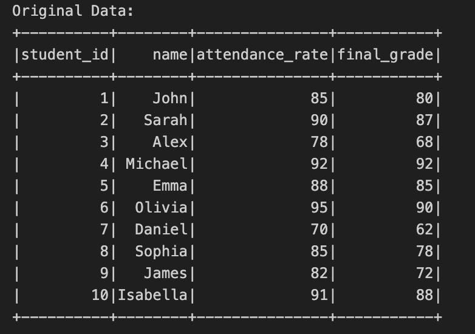
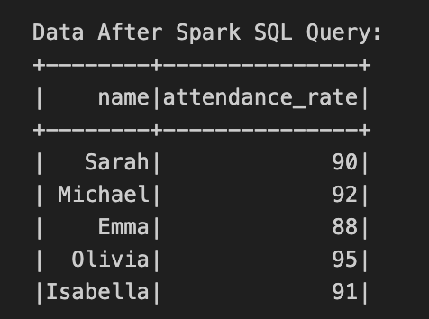
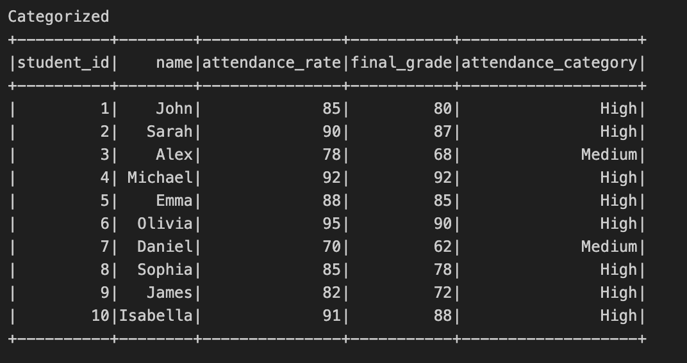

[](https://github.com/nogibjj/Mu-Niu-PySpark-Data-Processing/actions/workflows/CI.yml)

# Mu-Niu-PySpark-Data-Processing


## Project Functionalities

1. Read CSV

Show Original Dataset

```Python
def read_csv(session: SparkSession, file_path: str) -> DataFrame:
    # read csv
    data_file = session.read.csv(file_path, header=True, inferSchema=True)
    return data_file
```





2. Spark SQL Query

Show Queried Data: get the name and attendance rate of students who got higher than 80 in final grade

```Python
def spark_sql_query(spark: SparkSession, data: DataFrame):
    data.createOrReplaceTempView("performance")

    result = spark.sql(
        """
        SELECT name, 
               attendance_rate
        FROM performance
        WHERE final_grade > 80
    """
    )
    result.show()
    return result
```





3. Transformation

Show Categorized Data: categorize the attendance rate into 3 categories based on predefined thresholds

```Python
def transform(data: DataFrame) -> DataFrame:
    conditions = [
        (F.col("attendance_rate") < 50, "Low"),
        ((F.col("attendance_rate") >= 50) & (F.col("attendance_rate") < 80), "Medium"),
        (F.col("attendance_rate") >= 80, "High"),
    ]

    return data.withColumn(
        "attendance_category",
        F.when(conditions[0][0], conditions[0][1])
        .when(conditions[1][0], conditions[1][1])
        .otherwise(conditions[2][1]),
    )
```





